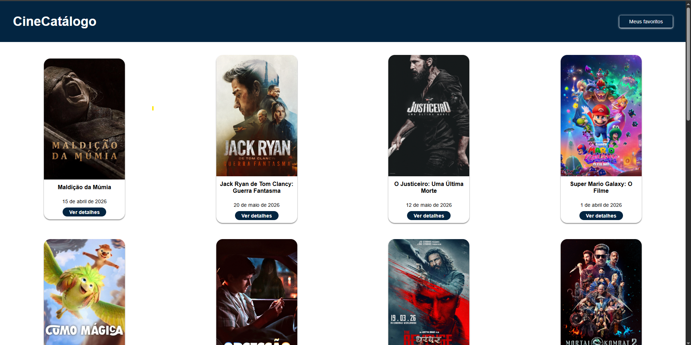

<h1 align="center"> 
	  🚀✅ CineCatálogo - Concluído ✅🚀
</h1>

 <a href="#-sobre-o-projeto">Sobre</a> •
 <a href="#-funcionalidades">Funcionalidades</a> •
 <a href="#-layout">Layout</a> • 
 <a href="#acesse-o-site-online">Acesse o Site Online</a> • 
 <a href="#tecnologias">Tecnologias</a> • 
 <a href="#o-que-pratiquei">O que pratiquei</a> • 
 <a href="#-autor">Autor</a> • 
 <a href="#-licença">Licença</a>

##  Sobre o Projeto

Projeto desenvolvido em React consumindo a API do TMDB para listar filmes em cartaz, visualizar detalhes e salvar favoritos.

## Funcionalidades

- Sistema de favoritos
- Persistência com localStorage
- Carregar mais filmes
- Trailer do filme
- Loading durante requisições

##  Layout
 

## Acesse o Site Online

Você pode visualizar o projeto diretamente no navegador sem precisar baixar:

➡️ [Clique aqui para acessar](https://cine-catalogo-psi.vercel.app/) 

## Tecnologias

- React
- React Router DOM
- Axios
- React Toastify
- CSS
- TMDB API

## O que pratiquei

- Consumo de API
- Async/Await
- useState
- useEffect
- Rotas com React Router
- LocalStorage
- Manipulação de arrays
- Paginação
- Renderização dinâmica

  
## Como contribuir para o projeto

1. Faça um **fork** do projeto.
2. Crie uma nova branch com as suas alterações: `git checkout -b my-feature`
3. Salve as alterações e crie uma mensagem de commit contando o que você fez: `git commit -m "feature: My new feature"`
4. Envie as suas alterações: `git push origin my-feature`
> Caso tenha alguma dúvida confira este [guia de como contribuir no GitHub](./CONTRIBUTING.md)

---

## Autor

<a href="https://br.linkedin.com/in/Joao-vitorSantos08">
João Vitor Santos souza</a>
  
 

## Licença

Este projeto esta sobe a licença [MIT](./LICENSE).

Feito por João Vitor Santos Souza👋🏽

